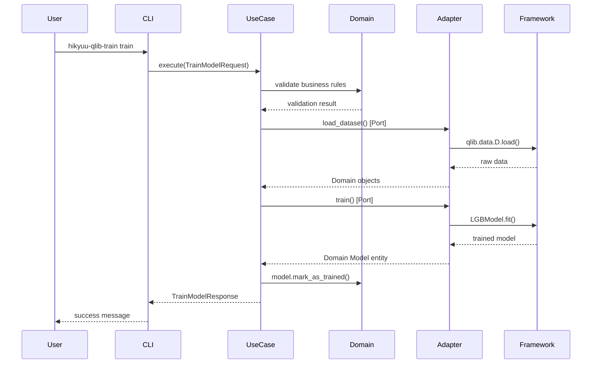

# 架构设计文档 v2.0 - Hikyuu × Qlib 量化交易平台

**架构模式**: Hexagonal Architecture (六边形架构) + Domain-Driven Design (DDD)
**版本**: 2.0.0
**更新日期**: 2025-11-11

> **变更说明**: 本文档基于六边形架构重新设计,取代了v1.0的传统分层架构。
> 旧版本文档已保存为 [`design.md.legacy`](./design.md.legacy)

---

## 1. 架构概述

### 1.1 架构目标

**业务目标**:

- 构建框架无关的核心业务逻辑
- 实现AI建模与策略执行的完整闭环
- 提供高度可测试和可维护的系统架构

**技术目标**:

- **依赖倒置**: Domain层定义接口(Ports),Adapters层实现
- **框架独立**: Domain层零外部依赖,可独立测试
- **高度可测试**: 每层独立测试,测试覆盖率>=90%
- **清晰边界**: 遵循严格的依赖规则

### 1.2 架构原则

基于**六边形架构**的核心原则:

1. **依赖规则**: 依赖只能向内 (Adapters → Use Cases → Domain)
2. **框架独立性**: Domain层不依赖任何外部框架
3. **依赖倒置**: Domain定义Ports接口,Adapters实现
4. **单一职责**: 每层只做一件事
5. **高内聚低耦合**: 模块内部高内聚,模块间低耦合
6. **测试驱动**: 先写测试,后写代码(TDD)

### 1.3 架构模式选择理由

**为什么选择六边形架构?**

传统分层架构的问题:

- ❌ Core模块直接依赖Hikyuu/Qlib框架
- ❌ 业务逻辑与技术实现耦合
- ❌ 难以测试(需要Mock整个框架)
- ❌ 框架升级影响业务逻辑

六边形架构的优势:

- ✅ 业务逻辑完全独立
- ✅ 框架可随时替换
- ✅ 高度可测试(Mock接口即可)
- ✅ 清晰的职责边界

---

## 2. 系统架构

### 2.1 整体架构图

```mermaid
graph TB
    subgraph CLI Controllers [CLI 控制器层]
        CLI1[hikyuu-qlib-data]
        CLI2[hikyuu-qlib-train]
        CLI3[hikyuu-qlib-backtest]
        CLI4[hikyuu-qlib-analyze]
        CLI5[hikyuu-qlib-config]
    end

    subgraph Adapters [适配器层 - 技术实现]
        HKAdapter[Hikyuu Adapters]
        QLAdapter[Qlib Adapters]
        Repos[Repositories]
    end

    subgraph Use Cases [应用层 - 业务流程]
        UC_Data[数据相关 Use Cases]
        UC_Model[模型相关 Use Cases]
        UC_Strategy[策略相关 Use Cases]
        UC_Analysis[分析相关 Use Cases]
    end

    subgraph Domain [领域层 - 核心业务规则]
        Entities[Entities<br/>Stock, Model, Order]
        VOs[Value Objects<br/>StockCode, Price, DateRange]
        Ports[Ports 接口<br/>IStockDataProvider, IModelTrainer]
    end

    subgraph Infrastructure [基础设施层]
        Config[配置管理]
        Logging[日志管理]
        DI[依赖注入]
    end

    CLI1 & CLI2 & CLI3 & CLI4 & CLI5 --> Adapters
    Adapters --> Use Cases
    Use Cases --> Domain

    HKAdapter -.实现.-> Ports
    QLAdapter -.实现.-> Ports

    Infrastructure -.支持.-> Adapters
    Infrastructure -.支持.-> Use Cases

    style Domain fill:#e1f5dd
    style Use Cases fill:#fff4dd
    style Adapters fill:#ffe6dd
    style Infrastructure fill:#e6e6fa
```

### 2.2 依赖规则可视化

```
┌─────────────────────────────────────┐
│   CLI Controllers                   │
│   (hikyuu-qlib-data等)              │
└──────────────┬──────────────────────┘
               │ 依赖
┌──────────────▼──────────────────────┐
│   Adapters                          │  ← 外层 (可替换)
│   - HikyuuDataAdapter               │
│   - QlibModelTrainerAdapter         │
│   - Repositories                    │
└──────────────┬──────────────────────┘
               │ 依赖
┌──────────────▼──────────────────────┐
│   Use Cases                         │  ← 中层 (应用)
│   - LoadStockDataUseCase            │
│   - TrainModelUseCase               │
│   - RunBacktestUseCase              │
└──────────────┬──────────────────────┘
               │ 依赖
┌──────────────▼──────────────────────┐
│   Domain                            │  ← 内层 (核心)
│   - Stock Entity                    │
│   - StockCode Value Object          │
│   - IStockDataProvider Port         │
│   - 零外部依赖 ✅                   │
└─────────────────────────────────────┘

规则: 依赖只能向内,内层对外层一无所知
```

---

## 3. 分层设计

### 3.1 Domain层 (src/domain/)

**职责**: 包含所有业务规则,零外部依赖

**目录结构**:

```
src/domain/
├── entities/           # 实体 (有ID,可变)
│   ├── stock.py
│   ├── model.py
│   ├── order.py
│   ├── trading_signal.py
│   └── experiment.py
├── value_objects/      # 值对象 (无ID,不可变)
│   ├── stock_code.py
│   ├── price.py
│   ├── date_range.py
│   ├── market.py
│   ├── model_id.py
│   ├── model_metrics.py
│   └── timeframe.py
├── aggregates/         # 聚合根 (一致性边界)
│   ├── portfolio.py
│   ├── trading_day.py
│   └── backtest.py
├── events/             # 领域事件
│   ├── model_trained.py
│   ├── order_placed.py
│   └── bar_added.py
├── ports/              # 端口接口定义 (Ports)
│   ├── stock_data_provider.py
│   ├── model_trainer.py
│   ├── backtest_engine.py
│   ├── signal_provider.py
│   └── experiment_recorder.py
└── services/           # 领域服务
    ├── price_adjustment_service.py
    ├── portfolio_rebalancer.py
    └── signal_validator.py
```

**核心约束**:

- ✅ 零外部依赖 (不能`import hikyuu`, `import qlib`)
- ✅ 所有Ports定义在此层
- ✅ 包含所有业务规则
- ✅ 测试覆盖率 >= 95%

**示例代码**:

```python
# domain/value_objects/stock_code.py
from dataclasses import dataclass

@dataclass(frozen=True)
class StockCode:
    """股票代码值对象 - 不可变"""
    value: str

    def __post_init__(self):
        if not self._is_valid():
            raise ValueError(f"Invalid stock code: {self.value}")

    def _is_valid(self) -> bool:
        """业务规则: 股票代码格式验证"""
        return len(self.value) == 8 and self.value[:2] in ["sh", "sz"]

# domain/entities/stock.py
from dataclasses import dataclass
from domain.value_objects.stock_code import StockCode

@dataclass
class Stock:
    """股票实体"""
    code: StockCode
    name: str
    market: str
    is_active: bool = True

    def is_tradable(self) -> bool:
        """业务规则: 判断是否可交易"""
        return self.is_active

# domain/ports/stock_data_provider.py
from abc import ABC, abstractmethod
import pandas as pd
from domain.value_objects.stock_code import StockCode
from domain.value_objects.date_range import DateRange

class IStockDataProvider(ABC):
    """Port: 股票数据提供者接口"""

    @abstractmethod
    async def load_stock_data(
        self,
        code: StockCode,
        date_range: DateRange
    ) -> pd.DataFrame:
        """加载股票数据"""
        pass
```

### 3.2 Use Cases层 (src/use_cases/)

**职责**: 编排Domain对象完成业务流程,只依赖Domain Ports

**目录结构**:

```
src/use_cases/
├── data/
│   ├── load_stock_data.py
│   ├── convert_data_format.py
│   └── validate_data_quality.py
├── models/
│   ├── train_model.py
│   ├── generate_predictions.py
│   ├── evaluate_model.py
│   └── save_model.py
├── strategies/
│   ├── run_backtest.py
│   ├── generate_signals.py
│   └── optimize_parameters.py
└── analysis/
    ├── generate_report.py
    ├── visualize_results.py
    └── compare_strategies.py
```

**核心约束**:

- ✅ 只依赖Domain (通过Ports接口)
- ✅ 使用Request/Response DTOs
- ✅ 编排流程,不包含业务规则
- ✅ 测试覆盖率 >= 90%

**示例代码**:

```python
# use_cases/models/train_model.py
from dataclasses import dataclass
from typing import Optional, Dict, Any
from domain.entities.model import Model
from domain.ports.data_provider import IDataProvider
from domain.ports.model_trainer import IModelTrainer

@dataclass
class TrainModelRequest:
    """训练模型请求 DTO"""
    model_type: str
    dataset_config: Dict[str, Any]
    experiment_name: str

@dataclass
class TrainModelResponse:
    """训练模型响应 DTO"""
    model: Optional[Model]
    success: bool
    error: Optional[str] = None

class TrainModelUseCase:
    """训练模型用例"""

    def __init__(
        self,
        data_provider: IDataProvider,    # Port依赖
        model_trainer: IModelTrainer     # Port依赖
    ):
        self.data_provider = data_provider
        self.trainer = model_trainer

    async def execute(
        self,
        request: TrainModelRequest
    ) -> TrainModelResponse:
        """执行训练流程"""
        # 1. 加载数据 (通过Port)
        dataset = await self.data_provider.load_dataset(
            request.dataset_config
        )

        # 2. 验证 (调用Domain规则)
        if not dataset.is_valid():
            return TrainModelResponse(
                model=None,
                success=False,
                error="Invalid dataset"
            )

        # 3. 训练模型 (通过Port)
        model = await self.trainer.train(
            model_type=request.model_type,
            dataset=dataset,
            parameters=request.parameters
        )

        # 4. 应用Domain规则
        model.mark_as_trained()

        return TrainModelResponse(
            model=model,
            success=True
        )
```

### 3.3 Adapters层 (src/adapters/)

**职责**: 实现Domain Ports,封装外部框架

**目录结构**:

```
src/adapters/
├── hikyuu/
│   ├── data_adapter.py           # 实现 IStockDataProvider
│   ├── indicator_adapter.py      # 实现 IIndicatorCalculator
│   ├── backtest_adapter.py       # 实现 IBacktestEngine
│   └── signal_adapter.py         # 实现 ISignalProvider
├── qlib/
│   ├── data_adapter.py           # 实现 IDatasetProvider
│   ├── model_trainer_adapter.py  # 实现 IModelTrainer
│   ├── predictor_adapter.py      # 实现 IPredictor
│   └── experiment_adapter.py     # 实现 IExperimentRecorder
├── repositories/
│   ├── model_repository.py
│   ├── experiment_repository.py
│   └── backtest_result_repository.py
└── controllers/
    ├── cli/
    │   ├── data_cli.py
    │   ├── train_cli.py
    │   ├── backtest_cli.py
    │   ├── analyze_cli.py
    │   └── config_cli.py
    └── api/                       # 预留API接口
```

**核心约束**:

- ✅ 实现Domain Ports接口
- ✅ 可以调用外部框架 (Hikyuu, Qlib)
- ✅ 不包含业务逻辑
- ✅ 测试覆盖率 >= 85%

**示例代码**:

```python
# adapters/hikyuu/data_adapter.py
import hikyuu as hku
import pandas as pd
from domain.ports.stock_data_provider import IStockDataProvider
from domain.value_objects.stock_code import StockCode
from domain.value_objects.date_range import DateRange

class HikyuuDataAdapter(IStockDataProvider):
    """Hikyuu数据适配器 - 实现Domain Port"""

    def __init__(self, config_file: str):
        self.config_file = config_file
        self._initialized = False

    async def load_stock_data(
        self,
        code: StockCode,      # Domain对象输入
        date_range: DateRange  # Domain对象输入
    ) -> pd.DataFrame:
        """实现Port接口"""
        self._ensure_initialized()

        # 1. Domain → Hikyuu 转换
        stock = hku.Stock(code.value)
        query = hku.Query(
            start=hku.Datetime(date_range.start),
            end=hku.Datetime(date_range.end)
        )

        # 2. 调用Hikyuu API
        kdata = stock.getKData(query)

        # 3. Hikyuu → DataFrame 转换
        return self._to_dataframe(kdata)

    def _ensure_initialized(self):
        """确保Hikyuu已初始化"""
        if not self._initialized:
            hku.init(self.config_file)
            self._initialized = True

    def _to_dataframe(self, kdata: hku.KData) -> pd.DataFrame:
        """转换KData为DataFrame"""
        data = {
            'datetime': [k.datetime for k in kdata],
            'open': [k.open for k in kdata],
            'high': [k.high for k in kdata],
            'low': [k.low for k in kdata],
            'close': [k.close for k in kdata],
            'volume': [k.volume for k in kdata]
        }
        return pd.DataFrame(data)

# adapters/qlib/model_trainer_adapter.py
import qlib
from qlib.contrib.model.gbdt import LGBModel
from domain.ports.model_trainer import IModelTrainer
from domain.entities.model import Model

class QlibModelTrainerAdapter(IModelTrainer):
    """Qlib模型训练适配器 - 实现Domain Port"""

    def __init__(self, qlib_dir: str):
        self.qlib_dir = qlib_dir
        self._initialized = False

    async def train(
        self,
        model_type: str,
        dataset: Any,
        parameters: Dict[str, Any]
    ) -> Model:
        """实现Port接口"""
        self._ensure_initialized()

        # 1. 根据类型创建Qlib模型
        if model_type == "LGBModel":
            qlib_model = LGBModel(**parameters)
        else:
            raise ValueError(f"Unsupported model type: {model_type}")

        # 2. 训练模型
        qlib_model.fit(dataset)

        # 3. 转换为Domain Entity
        return Model(
            id=ModelId.generate(),
            name=f"{model_type}_{timestamp}",
            model_type=model_type,
            parameters=parameters,
            metrics=self._extract_metrics(qlib_model),
            status=ModelStatus.TRAINED
        )

    def _ensure_initialized(self):
        """确保Qlib已初始化"""
        if not self._initialized:
            qlib.init(provider_uri=self.qlib_dir, region="REG_CN")
            self._initialized = True
```

### 3.4 Infrastructure层 (src/infrastructure/)

**职责**: 提供技术支持

**目录结构**:

```
src/infrastructure/
├── config/
│   ├── settings.py        # Pydantic BaseSettings
│   ├── hikyuu_settings.py
│   └── qlib_settings.py
├── logging/
│   ├── logger.py          # Loguru配置
│   └── formatters.py
├── database/
│   └── connection.py      # asyncpg连接
└── di/
    └── container.py       # 依赖注入容器
```

**核心约束**:

- ✅ 提供技术基础设施
- ✅ 不包含业务逻辑
- ✅ 测试覆盖率 >= 88%

**示例代码**:

```python
# infrastructure/di/container.py
from dependency_injector import containers, providers
from adapters.hikyuu.data_adapter import HikyuuDataAdapter
from adapters.qlib.model_trainer_adapter import QlibModelTrainerAdapter
from use_cases.models.train_model import TrainModelUseCase

class Container(containers.DeclarativeContainer):
    """依赖注入容器"""

    config = providers.Configuration()

    # Adapters
    hikyuu_data_adapter = providers.Singleton(
        HikyuuDataAdapter,
        config_file=config.hikyuu.config_file
    )

    qlib_model_trainer = providers.Singleton(
        QlibModelTrainerAdapter,
        qlib_dir=config.qlib.provider_uri
    )

    # Use Cases
    train_model_use_case = providers.Factory(
        TrainModelUseCase,
        data_provider=hikyuu_data_adapter,
        model_trainer=qlib_model_trainer
    )
```

---

## 4. 数据流设计

### 4.1 完整数据流



### 4.2 依赖注入流程

```python
# main.py
from infrastructure.di.container import Container

# 1. 创建容器
container = Container()
container.config.from_yaml('config.yaml')

# 2. 获取Use Case (自动注入依赖)
use_case = container.train_model_use_case()

# 3. 执行
request = TrainModelRequest(
    model_type="LGBModel",
    dataset_config={...},
    experiment_name="exp_001"
)
response = await use_case.execute(request)
```

---

## 5. 测试策略

### 5.1 测试金字塔

```
        ┌──────────┐
        │ E2E (10%)│  集成测试
        └──────────┘
      ┌──────────────┐
      │Integration   │  集成测试
      │   (20%)      │
      └──────────────┘
    ┌──────────────────┐
    │   Unit Tests     │  单元测试
    │     (70%)        │
    └──────────────────┘
```

### 5.2 各层测试策略

#### Domain层测试 (无Mock)

```python
# tests/unit/domain/entities/test_stock.py
def test_stock_is_tradable_when_active():
    """纯业务逻辑测试,无Mock"""
    stock = Stock(
        code=StockCode("sh000001"),
        name="上证指数",
        market="SH",
        is_active=True
    )

    assert stock.is_tradable() is True
```

#### Use Case层测试 (Mock Ports)

```python
# tests/unit/use_cases/models/test_train_model.py
@pytest.fixture
def mock_data_provider():
    provider = Mock(spec=IDataProvider)
    provider.load_dataset.return_value = Mock()
    return provider

async def test_train_model_use_case(mock_data_provider):
    """Mock Ports接口"""
    use_case = TrainModelUseCase(
        data_provider=mock_data_provider,
        model_trainer=Mock(spec=IModelTrainer)
    )

    response = await use_case.execute(request)

    assert response.success is True
    mock_data_provider.load_dataset.assert_called_once()
```

#### Adapter层测试 (Mock框架)

```python
# tests/unit/adapters/hikyuu/test_data_adapter.py
@patch('hikyuu.Stock')
def test_hikyuu_data_adapter(mock_stock):
    """Mock外部框架"""
    mock_stock.return_value.getKData.return_value = [...]

    adapter = HikyuuDataAdapter()
    data = await adapter.load_stock_data(...)

    assert isinstance(data, pd.DataFrame)
```

---

## 6. CLI工具设计

### 6.1 CLI控制器模式

```python
# adapters/controllers/cli/train_cli.py
import click
from infrastructure.di.container import get_container
from use_cases.models.train_model import TrainModelRequest

@click.command()
@click.option('--config', required=True)
@click.option('--model', required=True)
def train(config, model):
    """训练模型CLI"""
    # 1. 获取容器
    container = get_container()

    # 2. 构建Request
    request = TrainModelRequest(
        model_type=model,
        config_path=config
    )

    # 3. 执行Use Case
    use_case = container.train_model_use_case()
    response = asyncio.run(use_case.execute(request))

    # 4. 输出结果
    if response.success:
        click.echo(f"✅ 训练成功: {response.model.id}")
    else:
        click.echo(f"❌ 训练失败: {response.error}")
```

---

## 7. 对比: 新架构 vs 旧架构

| 维度 | 旧架构 (v1.0) | 新架构 (v2.0) |
|------|--------------|--------------|
| **架构模式** | 传统分层架构 | 六边形架构 + DDD |
| **依赖方向** | 混乱 (双向依赖) | 清晰 (只向内) |
| **Domain层** | 不存在 | 包含所有业务规则 |
| **框架依赖** | 核心模块直接依赖 | 通过Adapters隔离 |
| **可测试性** | 低 (需Mock整个框架) | 高 (Mock接口即可) |
| **覆盖率目标** | 无明确要求 | Domain ≥95%, Use Cases ≥90% |
| **开发方法** | Code First | TDD (Test First) |

---

## 8. 迁移路径

参见 [MIGRATION_GUIDE.md](../src/MIGRATION_GUIDE.md)

---

## 9. 参考资源

- [src/ARCHITECTURE.md](../src/ARCHITECTURE.md) - 完整架构文档
- [src/README.md](../src/README.md) - 快速开始
- [src/domain/.claude.md](../src/domain/.claude.md) - Domain层开发指南
- [src/use_cases/.claude.md](../src/use_cases/.claude.md) - Use Cases层开发指南
- [src/adapters/.claude.md](../src/adapters/.claude.md) - Adapters层开发指南

---

**架构负责人**: Architecture Team
**版本**: 2.0.0
**最后更新**: 2025-11-11
**状态**: ✅ 架构设计完成,待实施
