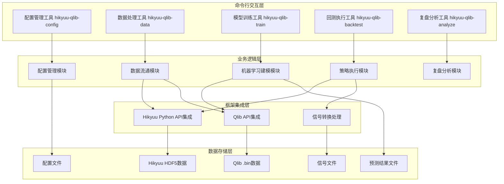
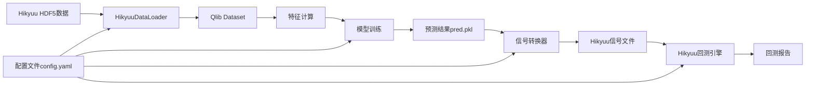
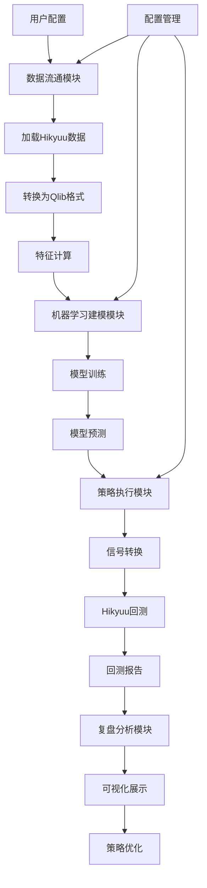

# 架构设计文档 - Hikyuu × Qlib 个人量化工作站

## 1. 架构概述

### 1.1 架构目标

**可扩展性:**

- 支持模块化组件设计，便于未来功能扩展
- 允许用户自定义策略组件和数据处理流程
- 支持多种数据源和模型类型的插件式接入

### 1.2 架构原则

- **单一职责原则**: 每个模块专注于特定功能领域
- **开闭原则**: 对扩展开放，对修改关闭
- **里氏替换原则**: 组件接口支持互相替换
- **接口隔离原则**: 最小化接口依赖关系
- **依赖倒置原则**: 高层模块不依赖低层模块实现

## 2. 系统架构

### 2.1 整体架构图



### 2.2 架构分层

#### 2.2.1 用户界面层

- **命令行配置管理工具**: 提供命令行接口编辑和管理配置文件
- **数据配置命令行向导**: 通过命令行引导用户完成Hikyuu数据源配置
- **策略执行命令行工具**: 展示模型训练、信号生成、回测执行进度
- **复盘分析命令行工具**: 提供回测结果可视化和多策略对比功能

#### 2.2.2 业务逻辑层

- **数据流通模块**: 负责Hikyuu数据到Qlib的数据加载和转换
- **机器学习建模模块**: 提供Qlib模型训练、预测和实验管理功能
- **策略执行模块**: 处理信号转换和Hikyuu回测执行
- **配置管理模块**: 统一管理系统配置和参数
- **复盘分析模块**: 生成回测报告和策略对比分析

#### 2.2.3 框架集成层

- **Hikyuu Python API集成**: 封装Hikyuu Python API核心功能接口
- **Qlib API集成**: 封装Qlib API核心功能接口
- **信号转换处理**: 实现Qlib预测结果到Hikyuu信号的格式转换

#### 2.2.4 数据存储层

- **Hikyuu HDF5数据**: 存储原始行情数据和复权因子
- **Qlib .bin数据**: 存储Qlib格式的特征数据
- **配置文件**: Hikyuu INI格式和Qlib YAML格式的系统配置
- **预测结果文件**: Qlib模型输出的pred.pkl文件
- **信号文件**: 转换后的Hikyuu信号文件（CSV/JSON）

## 3. 服务设计

### 3.1 模块拆分

| 模块名称 | 职责 | 技术栈 | 数据存储 | 命令行工具 |
|----------|------|--------|--------|------------|
| 数据流通模块 | Hikyuu数据加载、格式转换、特征计算 | Python + Pandas + HDF5 | HDF5 + .bin文件 | hikyuu-qlib-data |
| 机器学习建模模块 | 模型训练、预测、实验管理 | Python + Qlib + LightGBM | pred.pkl + 实验记录 | hikyuu-qlib-train |
| 策略执行模块 | 信号转换、回测执行、调仓建议 | Python + Hikyuu | CSV/JSON信号文件 | hikyuu-qlib-backtest |
| 配置管理模块 | 统一配置管理、参数验证 | Python + PyYAML | YAML/INI配置文件 | hikyuu-qlib-config |
| 复盘分析模块 | 回测报告生成、策略对比 | Python + Matplotlib | 报告文件 + 图表 | hikyuu-qlib-analyze |

### 3.2 模块间通信

#### 3.2.1 同步通信

- **协议**: 函数调用 + 文件传递
- **数据格式**: HDF5、.bin、CSV、JSON、YAML/INI

#### 3.2.2 异步通信

- **消息队列**: 不涉及（个人量化工作站无需复杂消息队列）
- **事件驱动**: 基于文件系统事件和配置变更事件

### 3.3 命令行工具设计

#### 3.3.1 数据处理命令行工具 (hikyuu-qlib-data)

```bash
# 初始化Hikyuu数据
hikyuu-qlib-data init --config hikyuu.ini --data-dir ./data/hikyuu

# 转换Hikyuu数据到Qlib格式
hikyuu-qlib-data convert --source ./data/hikyuu --target ./data/qlib --instruments sh000001,sz000001

# 验证数据完整性
hikyuu-qlib-data validate --source ./data/hikyuu --target ./data/qlib
```

#### 3.3.2 模型训练命令行工具 (hikyuu-qlib-train)

```bash
# 训练模型
hikyuu-qlib-train train --config config.yaml --model LGBModel --experiment exp_001

# 预测
hikyuu-qlib-train predict --model-path ./models/exp_001 --data-config data_config.yaml

# 查看实验记录
hikyuu-qlib-train list --experiments
```

#### 3.3.3 回测执行命令行工具 (hikyuu-qlib-backtest)

```bash
# 执行回测
hikyuu-qlib-backtest run --prediction ./results/pred.pkl --signal-format CSV --start-date 2021-01-01 --end-date 2023-12-31

# 生成回测报告
hikyuu-qlib-backtest report --results-path ./results --output-format html

# 查看回测结果
hikyuu-qlib-backtest summary --results-path ./results
```

#### 3.3.4 配置管理命令行工具 (hikyuu-qlib-config)

```bash
# 生成默认配置
hikyuu-qlib-config generate --type hikyuu --output hikyuu.ini
hikyuu-qlib-config generate --type qlib --output config.yaml

# 验证配置
hikyuu-qlib-config validate --config config.yaml

# 更新配置
hikyuu-qlib-config update --config config.yaml --key model.type --value LGBModel
```

#### 3.3.5 复盘分析命令行工具 (hikyuu-qlib-analyze)

```bash
# 生成分析报告
hikyuu-qlib-analyze report --results-path ./results --output-dir ./reports

# 策略对比
hikyuu-qlib-analyze compare --strategies strategy1,strategy2 --metric sharpe_ratio

# 可视化结果
hikyuu-qlib-analyze plot --results-path ./results --type equity_curve
```

### 3.3 核心类接口设计

#### 3.3.1 Hikyuu初始化接口

```python
class HikyuuInitializer:
    """
    Hikyuu框架初始化类
    """
    def __init__(self, config_file: str = None):
        """
        初始化Hikyuu框架
        
        Args:
            config_file: 配置文件路径，默认为 ~/.hikyuu/hikyuu.ini
        """
        pass
    
    def initialize(self, stock_list: list = None, ktype_list: list = None,
                  preload_num: dict = None, start_spot: bool = False):
        """
        执行Hikyuu初始化
        
        Args:
            stock_list: 指定加载的股票列表，默认为全部A股
            ktype_list: 指定加载的K线类型列表，如: ['day', 'week', 'month']
            preload_num: 预加载参数，如: {'day_max': 100000, 'week_max': 1000}
            start_spot: 是否启动行情接收，默认为False
        """
        pass
```

#### 3.3.2 数据流通接口

```python
class HikyuuDataLoader:
    """
    Hikyuu数据加载器
    """
    def load_stock_data(self, stock_code: str, query: hikyuu.Query) -> hikyuu.KData:
        """
        加载单个股票的K线数据
        
        Args:
            stock_code: 股票代码，如 'sh000001'
            query: 查询对象，指定查询范围和K线类型
            
        Returns:
            KData对象
        """
        pass
    
    def extract_to_dataframe(self, kdata: hikyuu.KData) -> pd.DataFrame:
        """
        将KData转换为Pandas DataFrame
        
        Args:
            kdata: KData对象
            
        Returns:
            MultiIndex DataFrame (datetime, instrument)
        """
        pass

class QlibDataConverter:
    """
    Qlib数据转换器，将Hikyuu HDF5数据转换为Qlib .bin格式
    """
    def __init__(self, qlib_dir: str, region: str = "REG_CN"):
        """
        初始化Qlib数据转换器
        
        Args:
            qlib_dir: Qlib数据目录
            region: 市场区域，中国市场使用REG_CN
        """
        self.qlib_dir = qlib_dir
        self.region = region
    
    def convert_hikyuu_to_qlib(self, stock_data: dict, fields: list):
        """
        将Hikyuu数据转换为Qlib格式
        
        Args:
            stock_data: 股票数据字典 {stock_code: DataFrame}
            fields: 字段列表 ['open', 'high', 'low', 'close', 'volume', 'factor']
        """
        # 按照Qlib的dump_bin.py期望的结构组织数据
        # 每只股票作为单独的目录，每个字段作为单独的.bin文件
        for stock_code, df in stock_data.items():
            stock_dir = os.path.join(self.qlib_dir, stock_code)
            os.makedirs(stock_dir, exist_ok=True)
            
            for field in fields:
                if field in df.columns:
                    field_data = df[field].values
                    field_file = os.path.join(stock_dir, f"{field}.bin")
                    field_data.tofile(field_file)
    
    def create_qlib_instrument_config(self, stock_codes: list):
        """
        创建Qlib标的配置文件
        
        Args:
            stock_codes: 股票代码列表
        """
        instrument_config = {
            "market": self.region,
            "instrument_list": stock_codes
        }
        
        config_file = os.path.join(self.qlib_dir, "instruments", f"{self.region.lower()}.txt")
        os.makedirs(os.path.dirname(config_file), exist_ok=True)
        
        with open(config_file, 'w') as f:
            for stock_code in stock_codes:
                f.write(f"{stock_code}\n")
    
    def create_qlib_calendar_config(self, trading_days: list):
        """
        创建Qlib交易日历配置文件
        
        Args:
            trading_days: 交易日列表 [datetime, ...]
        """
        calendar_file = os.path.join(self.qlib_dir, "calendars", "day.txt")
        os.makedirs(os.path.dirname(calendar_file), exist_ok=True)
        
        with open(calendar_file, 'w') as f:
            for day in trading_days:
                f.write(f"{day.strftime('%Y-%m-%d')}\n")

class QlibDataProcessor:
    """
    Qlib数据处理器，使用Qlib的处理器进行特征工程
    """
    def __init__(self):
        """
        初始化数据处理器
        """
        self.processors = []
    
    def add_processor(self, processor):
        """
        添加数据处理器
        
        Args:
            processor: Qlib处理器实例
        """
        self.processors.append(processor)
    
    def process_data(self, df: pd.DataFrame) -> pd.DataFrame:
        """
        处理数据
        
        Args:
            df: 输入数据
            
        Returns:
            处理后的数据
        """
        for processor in self.processors:
            df = processor(df)
        return df
```

#### 3.3.3 模型训练接口

```python
class QlibInitializer:
    """
    Qlib初始化器
    """
    def __init__(self, provider_uri: str, region: str = "REG_CN"):
        """
        初始化Qlib框架
        
        Args:
            provider_uri: 数据提供者URI，指向Qlib数据目录
            region: 市场区域，中国市场使用REG_CN
        """
        self.provider_uri = provider_uri
        self.region = region
        self.initialized = False
    
    def initialize(self, redis_host: str = None, redis_port: int = None,
                 expression_cache: str = None, dataset_cache: str = None):
        """
        执行Qlib初始化
        
        Args:
            redis_host: Redis主机地址
            redis_port: Redis端口
            expression_cache: 表达式缓存路径
            dataset_cache: 数据集缓存路径
        """
        import qlib
        
        qlib.init(
            provider_uri=self.provider_uri,
            region=self.region,
            redis_host=redis_host,
            redis_port=redis_port,
            expression_cache=expression_cache,
            dataset_cache=dataset_cache
        )
        self.initialized = True

class QlibWorkflowManager:
    """
    Qlib工作流管理器
    """
    def __init__(self, qlib_initializer: QlibInitializer):
        """
        初始化工作流管理器
        
        Args:
            qlib_initializer: Qlib初始化器
        """
        self.qlib_initializer = qlib_initializer
    
    def create_workflow_config(self, model_config: dict, dataset_config: dict,
                           experiment_name: str) -> dict:
        """
        创建工作流配置
        
        Args:
            model_config: 模型配置
            dataset_config: 数据集配置
            experiment_name: 实验名称
            
        Returns:
            工作流配置字典
        """
        workflow_config = {
            "qlib_init": {
                "provider_uri": self.qlib_initializer.provider_uri,
                "region": self.qlib_initializer.region
            },
            "market": {
                "market": self.qlib_initializer.region,
                "benchmark": "SH000300",
                "trade_unit": 100,
                "limit_threshold": 0.099
            },
            "data_handler_config": {
                "start_time": dataset_config.get("start_time", "2010-01-01"),
                "end_time": dataset_config.get("end_time", "2023-12-31"),
                "fit_start_time": dataset_config.get("fit_start_time", "2010-01-01"),
                "fit_end_time": dataset_config.get("fit_end_time", "2020-12-31"),
                "instruments": dataset_config.get("instruments", ["SH000001", "SZ000001"]),
                "learn_processors": [
                    {"class": "DropnaProcessor"},
                    {"class": "ZscoreNorm", "fields_group": "feature"}
                ],
                "process_type": "independent"
            },
            "model": model_config,
            "dataset": {
                "class": "DatasetH",
                "module_path": "qlib.data.dataset",
                "kwargs": {
                    "handler": {
                        "class": "Alpha158",
                        "module_path": "qlib.contrib.data.handler",
                        "kwargs": dataset_config
                    }
                }
            },
            "record": {
                "class": "SignalRecord",
                "module_path": "qlib.workflow.record"
            }
        }
        
        return workflow_config
    
    def run_workflow(self, workflow_config: dict, experiment_name: str):
        """
        运行工作流
        
        Args:
            workflow_config: 工作流配置
            experiment_name: 实验名称
        """
        import qlib
        from qlib.workflow import R
        
        if not self.qlib_initializer.initialized:
            self.qlib_initializer.initialize()
        
        with R.start(experiment_name=experiment_name):
            # 生成工作流YAML文件
            workflow_file = f"{experiment_name}_workflow.yaml"
            with open(workflow_file, 'w') as f:
                import yaml
                yaml.dump(workflow_config, f)
            
            # 使用qrun执行工作流
            import subprocess
            subprocess.run(["qrun", workflow_file], check=True)
    
    def train_model(self, model_config: dict, dataset_config: dict,
                   experiment_name: str) -> str:
        """
        训练Qlib模型
        
        Args:
            model_config: 模型配置，包含模型类型、参数等
            dataset_config: 数据集配置，包含特征、标签等
            experiment_name: 实验名称
            
        Returns:
            模型路径
        """
        workflow_config = self.create_workflow_config(model_config, dataset_config, experiment_name)
        self.run_workflow(workflow_config, experiment_name)
        
        # 返回模型路径
        return f"./mlflow/{experiment_name}/artifacts/model.pkl"
    
    def predict(self, model_path: str, data_config: dict) -> str:
        """
        使用训练好的模型进行预测
        
        Args:
            model_path: 模型路径
            data_config: 预测数据配置
            
        Returns:
            预测结果文件路径
        """
        import qlib
        from qlib.workflow import R
        
        # 加载模型
        model = qlib.model.load(model_path)
        
        # 准备数据
        dataset = qlib.data.Dataset(
            handler=qlib.data.handler.Alpha158(**data_config)
        )
        
        # 进行预测
        with R.start(experiment_name="prediction"):
            pred = model.predict(dataset)
            pred_file = f"./results/pred_{R.get_recorder().id}.pkl"
            pred.to_pickle(pred_file)
        
        return pred_file
```

#### 3.3.4 信号转换接口

```python
class QlibPredictionParser:
    """
    Qlib预测结果解析器
    """
    def __init__(self, prediction_path: str):
        """
        初始化预测结果解析器
        
        Args:
            prediction_path: Qlib预测结果文件路径
        """
        self.prediction_path = prediction_path
        self.prediction_data = None
    
    def load_prediction(self):
        """
        加载预测结果
        """
        import pandas as pd
        self.prediction_data = pd.read_pickle(self.prediction_path)
        
        # 确保数据格式正确：MultiIndex(datetime, instrument) + 预测分数列
        if not isinstance(self.prediction_data.index, pd.MultiIndex):
            raise ValueError("预测结果必须包含MultiIndex(datetime, instrument)")
    
    def get_prediction_scores(self, stock_code: str = None,
                          start_date: str = None, end_date: str = None):
        """
        获取预测分数
        
        Args:
            stock_code: 股票代码，None表示所有股票
            start_date: 开始日期，None表示最早日期
            end_date: 结束日期，None表示最晚日期
            
        Returns:
            预测分数DataFrame
        """
        if self.prediction_data is None:
            self.load_prediction()
        
        data = self.prediction_data.copy()
        
        # 按股票代码过滤
        if stock_code is not None:
            data = data[data.index.get_level_values('instrument') == stock_code]
        
        # 按日期过滤
        if start_date is not None:
            data = data[data.index.get_level_values('datetime') >= start_date]
        
        if end_date is not None:
            data = data[data.index.get_level_values('datetime') <= end_date]
        
        return data

class CustomSG_QlibFactor(hikyuu.SignalBase):
    """
    自定义Qlib因子信号指示器
    """
    def __init__(self, prediction_path: str, top_k: int = 10,
                 threshold: float = 0.5, normalization: str = "zscore"):
        """
        初始化信号指示器
        
        Args:
            prediction_path: Qlib预测结果文件路径
            top_k: 选股数量
            threshold: 信号阈值
            normalization: 标准化方法，"zscore"或"minmax"
        """
        super().__init__()
        self.prediction_parser = QlibPredictionParser(prediction_path)
        self.top_k = top_k
        self.threshold = threshold
        self.normalization = normalization
        self.prediction_scores = None
    
    def _calculate(self):
        """
        计算信号，继承自SignalBase的抽象方法
        """
        # 获取当前股票和日期的预测分数
        current_datetime = self.get_datetime()
        current_stock = self.get_stock()
        
        # 加载预测分数
        if self.prediction_scores is None:
            self.prediction_scores = self.prediction_parser.get_prediction_scores()
        
        # 获取当前股票在当前日期的预测分数
        try:
            score = self.prediction_scores.loc[(current_datetime, current_stock)].iloc[0]
        except (KeyError, IndexError):
            # 如果没有对应的预测分数，返回0信号
            self._set_value(0)
            return
        
        # 标准化预测分数
        if self.normalization == "zscore":
            # 使用Z-Score标准化
            mean_score = self.prediction_scores.mean()
            std_score = self.prediction_scores.std()
            if std_score > 0:
                normalized_score = (score - mean_score) / std_score
            else:
                normalized_score = 0
        elif self.normalization == "minmax":
            # 使用Min-Max标准化
            min_score = self.prediction_scores.min()
            max_score = self.prediction_scores.max()
            if max_score > min_score:
                normalized_score = (score - min_score) / (max_score - min_score)
            else:
                normalized_score = 0.5
        else:
            normalized_score = score
        
        # 生成信号
        if normalized_score > self.threshold:
            # 基于Top-K选股逻辑
            # 获取当前日期所有股票的预测分数
            daily_scores = self.prediction_scores.loc[current_datetime]
            # 按分数降序排序
            daily_scores = daily_scores.sort_values(ascending=False)
            # 获取Top-K股票
            top_k_stocks = daily_scores.head(self.top_k).index.tolist()
            
            # 如果当前股票在Top-K中，生成买入信号
            if current_stock in top_k_stocks:
                self._set_value(1)  # 买入信号
            else:
                self._set_value(0)  # 无信号
        else:
            self._set_value(0)  # 无信号

class SignalRecordManager:
    """
    信号记录管理器，使用Qlib的SignalRecord和PortAnaRecord
    """
    def __init__(self, experiment_name: str):
        """
        初始化信号记录管理器
        
        Args:
            experiment_name: 实验名称
        """
        self.experiment_name = experiment_name
        self.signal_records = []
        self.portfolio_records = []
    
    def add_signal_record(self, prediction_df: pd.DataFrame):
        """
        添加信号记录
        
        Args:
            prediction_df: 预测结果DataFrame
        """
        from qlib.workflow.record import SignalRecord
        
        record = SignalRecord(
            pred=prediction_df,
            label=None,  # 可选标签
            recorder_id=len(self.signal_records)
        )
        self.signal_records.append(record)
    
    def add_portfolio_record(self, portfolio_df: pd.DataFrame):
        """
        添加投资组合记录
        
        Args:
            portfolio_df: 投资组合DataFrame
        """
        from qlib.workflow.record import PortAnaRecord
        
        record = PortAnaRecord(
            portfolio=portfolio_df,
            recorder_id=len(self.portfolio_records)
        )
        self.portfolio_records.append(record)
    
    def get_signal_analysis(self):
        """
        获取信号分析结果
        
        Returns:
            信号分析结果
        """
        if not self.signal_records:
            return None
        
        # 合并所有信号记录
        all_signals = pd.concat([record.pred for record in self.signal_records])
        
        return {
            "signal_count": len(all_signals),
            "signal_distribution": all_signals.describe(),
            "average_signal": all_signals.mean(),
            "signal_volatility": all_signals.std()
        }

class SignalConverter:
    """
    信号转换器
    """
    def __init__(self, prediction_path: str):
        """
        初始化信号转换器
        
        Args:
            prediction_path: Qlib预测结果文件路径
        """
        self.prediction_parser = QlibPredictionParser(prediction_path)
        self.record_manager = SignalRecordManager("signal_conversion")
    
    def convert_prediction_to_signals(self, output_format: str = "CSV") -> str:
        """
        将Qlib预测结果转换为Hikyuu信号格式
        
        Args:
            output_format: 输出格式 (CSV/JSON)
            
        Returns:
            信号文件路径
        """
        # 加载预测结果
        self.prediction_parser.load_prediction()
        prediction_data = self.prediction_parser.prediction_data
        
        # 添加信号记录
        self.record_manager.add_signal_record(prediction_data)
        
        # 转换为Hikyuu信号格式
        # MultiIndex (datetime, instrument) -> 列格式
        signal_df = prediction_data.reset_index()
        
        # 创建输出目录
        os.makedirs("./signals", exist_ok=True)
        
        # 根据输出格式保存
        if output_format.upper() == "CSV":
            output_file = "./signals/hikyuu_signals.csv"
            signal_df.to_csv(output_file, index=False)
        elif output_format.upper() == "JSON":
            output_file = "./signals/hikyuu_signals.json"
            signal_df.to_json(output_file, orient="records")
        else:
            raise ValueError(f"不支持的输出格式: {output_format}")
        
        return output_file
```

#### 3.3.5 回测执行接口

```python
class HikyuuBacktestEngine:
    """
    Hikyuu回测引擎
    """
    def create_trade_manager(self, init_cash: float = 1000000) -> hikyuu.TradeManager:
        """
        创建交易管理器
        
        Args:
            init_cash: 初始资金
            
        Returns:
            TradeManager对象
        """
        pass
    
    def create_trading_system(self, sg: hikyuu.SignalBase, mm: hikyuu.MoneyManagerBase,
                           st: hikyuu.StoplossBase = None, tp: hikyuu.StoplossBase = None,
                           sp: hikyuu.SlippageBase = None) -> hikyuu.SystemBase:
        """
        创建交易系统
        
        Args:
            sg: 信号指示器
            mm: 资金管理策略
            st: 止损策略
            tp: 止盈策略（注意：使用ST_前缀）
            sp: 移滑价差算法
            
        Returns:
            SystemBase对象
        """
        pass
    
    def run_backtest(self, system: hikyuu.SystemBase, stock_code: str,
                    query: hikyuu.Query) -> hikyuu.Performance:
        """
        执行回测
        
        Args:
            system: 交易系统
            stock_code: 股票代码
            query: 查询对象
            
        Returns:
            Performance对象
        """
        pass
```

## 4. 数据架构

### 4.1 数据存储策略

- **Hikyuu HDF5数据**: 存储原始行情数据和复权因子
- **Qlib .bin数据**: 存储Qlib格式的特征数据
- **配置文件**: Hikyuu INI格式和Qlib YAML格式的系统配置
- **预测结果文件**: 存储Qlib模型输出的pred.pkl文件
- **信号文件**: 存储转换后的Hikyuu信号格式

### 4.2 数据流设计



### 4.3 数据一致性

- **强一致性场景**: 数据加载过程中的格式转换和验证
- **最终一致性场景**: 模型训练和预测结果的异步更新
- **版本控制**: 配置文件和实验记录的版本管理

## 5. 关键集成设计

### 5.1 Hikyuu与Qlib集成方案

#### 5.1.1 数据流通集成

- **数据源**: Hikyuu HDF5格式存储的行情数据，通过hikyuu.StockManager和hikyuu.KData访问
- **数据目标**: Qlib .bin格式存储的特征数据，通过qlib.init()和qlib.data访问
- **转换过程**:
  1. 使用hikyuu.StockManager获取证券列表和基本信息
  2. 使用hikyuu.KData获取K线数据，应用复权因子
  3. 转换为Qlib所需的MultiIndex DataFrame格式
  4. 使用qlib.data.D.save()生成Qlib .bin格式文件

#### 5.1.2 特征计算集成

- **基础特征**: 基于Hikyuu的hikyuu.indicator模块计算EMA、MACD、RSI等技术指标
- **特征表达式**: 使用Qlib的表达式引擎定义特征计算逻辑
- **特征编排**: 支持用户自定义特征组合和参数调整，通过YAML配置文件管理

#### 5.1.3 信号转换集成

- **输入格式**: Qlib pred.pkl文件（使用qlib.workflow.R.read_pred()读取）
- **输出格式**: Hikyuu信号格式（CSV/JSON，可被hikyuu交易系统使用）
- **转换规则**:
  1. 支持Top-K选股策略（基于预测分数排序）
  2. 支持择时信号映射（将预测分数转换为买入/卖出信号）
  3. 支持阈值过滤和信号标准化

#### 5.1.4 Hikyuu回测集成

- **TradeManager集成**: 使用hikyuu.TradeManager进行交易账户管理
- **交易系统组件集成**:
  - 信号指示器（SG）：使用自定义SG_QlibFactor将Qlib预测信号转换为Hikyuu交易信号
  - 资金管理策略（MM）：使用hikyuu.trade_sys.MM_FixedCount、hikyuu.trade_sys.MM_FixedRisk等
  - 止损止盈策略（ST/TP）：使用hikyuu.trade_sys.ST_FixedPercent、hikyuu.trade_sys.TP_FixedPercent等
  - 移滑价差算法（SP）：使用hikyuu.trade_sys.cost_func，支持沪深A股等多种交易成本计算
- **Performance统计集成**: 使用hikyuu.Performance进行回测绩效分析
- **投资组合集成**: 使用hikyuu.trade_sys.PF和hikyuu.trade_sys.SYS_WalkForward支持多策略组合和滚动交易系统

### 5.2 配置驱动设计

#### 5.2.1 配置结构

**Hikyuu INI配置** (hikyuu.ini):

```ini
[hikyuu]
tmpdir = ./data/hikyuu
datadir = ./data/hikyuu
quotation_server = ipc:///tmp/hikyuu_real.ipc
load_history_finance = True
load_stock_weight = True

[baseinfo]
type = sqlite3
db = stock.db

[kdata]
type = hdf5
dir = ./data/hikyuu

[preload]
day = true
day_max = 4096
week = true
week_max = 1000
```

**Qlib YAML配置** (config.yaml):

```yaml
# 数据配置
data:
  hikyuu_data_dir: "./data/hikyuu"
  market: "SH"
  instruments: ["000001", "600000"]
  start_time: "2020-01-01"
  end_time: "2023-12-31"
  
# 模型配置
model:
  type: "LGBModel"
  features: ["EMA5", "EMA10", "MACD", "RSI"]
  training_window: "252D"
  experiment_name: "default_exp"
  
# 策略配置
strategy:
  signal_format: "CSV"
  top_k: 10
  threshold: 0.5
  
# 回测配置
backtest:
  initial_cash: 1000000
  start_date: "2021-01-01"
  end_date: "2023-12-31"
  cost_commission: 0.001
```

#### 5.2.2 配置管理

- **统一配置**: 所有模块参数统一在config.yaml中管理
- **参数验证**: 配置加载时进行参数有效性验证
- **版本管理**: 支持配置文件的版本控制和回滚

### 5.3 端到端流程设计

#### 5.3.1 完整流程图



#### 5.3.2 模块协作关系

1. **数据流通模块**为机器学习建模模块提供标准化的训练数据
2. **机器学习建模模块**为策略执行模块提供预测信号
3. **策略执行模块**为复盘分析模块提供回测结果
4. **配置管理模块**为所有模块提供统一的配置管理
5. **复盘分析模块**为用户提供决策支持和优化建议

## 6. 技术栈选择理由

### 6.1 核心技术栈

- **Python**: 主要开发语言，丰富的金融和机器学习库生态
- **Hikyuu**: 成熟的量化交易框架，提供完整的回测和执行引擎
- **Qlib**: 微软开源的AI量化平台，提供强大的机器学习能力
- **Pandas**: 数据处理和分析的核心库
- **HDF5**: 高效的金融数据存储格式
- **Click**: 命令行工具框架，提供参数验证和自动帮助文档生成

### 6.2 辅助技术栈

- **PyYAML**: 配置文件解析和管理
- **Matplotlib**: 回测结果可视化
- **LightGBM**: 默认的机器学习模型
- **NumPy**: 数值计算支持
- **ConfigParser**: Hikyuu INI配置文件解析

### 6.3 选型理由

- **Python**: 金融量化领域的标准语言，社区活跃，库生态完善
- **Hikyuu**: 专门针对中文市场设计的量化框架，支持完整的交易系统，包括SYS_WalkForward滚动寻优系统
- **Qlib**: 企业级的AI量化平台，提供端到端的机器学习解决方案
- **HDF5**: 高性能的金融数据存储格式，支持大规模历史数据
- **Click**: 成熟的命令行工具框架，Hikyuu已采用类似方案
- **LightGBM**: 高效的梯度提升树算法，适合金融时序预测

## 7. 高级功能架构设计

### 7.1 滚动交易系统(SYS_WalkForward)架构

#### 7.1.1 SYS_WalkForward工作原理

```python
class SYS_WalkForwardIntegration:
    """
    Hikyuu滚动寻优系统集成类
    """
    def __init__(self, model_paths: list, train_len: int = 100, test_len: int = 20):
        """
        初始化滚动寻优系统
        
        Args:
            model_paths: Qlib模型路径列表，对应多个候选系统
            train_len: 训练期长度，默认100天
            test_len: 测试期长度，默认20天
        """
        self.model_paths = model_paths
        self.train_len = train_len
        self.test_len = test_len
        self.system_list = []
        self.walk_forward_sys = None
    
    def create_candidate_systems(self, tm: hikyuu.TradeManager):
        """
        创建基于不同Qlib模型的候选交易系统
        
        Args:
            tm: 交易管理器
        """
        self.system_list = []
        for model_path in self.model_paths:
            # 创建自定义信号指示器
            sg = CustomSG_QlibFactor(model_path)
            # 创建资金管理策略
            mm = hikyuu.MM_FixedCount(1000)
            # 创建止损策略
            st = hikyuu.ST_FixedPercent(0.05)
            # 创建移滑价差算法
            sp = hikyuu.SP_FixedPercent(0.001)
            
            # 创建交易系统
            sys = hikyuu.SYS_Simple(sg=sg, mm=mm, st=st, sp=sp)
            self.system_list.append(sys)
    
    def create_walk_forward_system(self, tm: hikyuu.TradeManager,
                                 se: hikyuu.SelectorBase = None):
        """
        创建滚动寻优系统
        
        Args:
            tm: 交易管理器
            se: 选择器，默认使用SE_PerformanceOptimal
        """
        if se is None:
            # 使用默认选择器：基于"帐户平均年收益率%"最大选择
            se = hikyuu.SE_PerformanceOptimal(key="帐户平均年收益率%", mode=0)
        
        self.walk_forward_sys = hikyuu.SYS_WalkForward(
            sys_list=self.system_list,
            tm=tm,
            train_len=self.train_len,
            test_len=self.test_len,
            se=se
        )
    
    def run_backtest(self, stock: hikyuu.Stock, query: hikyuu.Query):
        """
        执行滚动寻优回测
        
        Args:
            stock: 股票对象
            query: 查询对象
            
        Returns:
            回测结果
        """
        if self.walk_forward_sys is None:
            raise ValueError("滚动寻优系统未初始化")
        
        return self.walk_forward_sys.run(stock, query)
```

#### 7.1.2 自定义选择器设计

```python
class CustomSelector(hikyuu.SelectorBase):
    """
    自定义系统选择器
    """
    def __init__(self, key: str = "夏普比率", mode: int = 0):
        """
        初始化选择器
        
        Args:
            key: 选择依据的绩效指标
            mode: 选择模式（0：最大值，1：最小值）
        """
        super().__init__()
        self.key = key
        self.mode = mode
    
    def _calculate(self):
        """
        计算选择结果，继承自SelectorBase的抽象方法
        """
        # 实现自定义选择逻辑
        pass
```

### 7.2 批量系统分析架构

#### 7.2.1 批量系统分析设计

```python
class BatchSystemAnalyzer:
    """
    批量系统分析器
    """
    def __init__(self):
        """
        初始化批量系统分析器
        """
        self.system_list = []
        self.stock_list = []
        self.results = []
    
    def add_system(self, sg: hikyuu.SignalBase, tm: hikyuu.TradeManager):
        """
        添加交易系统
        
        Args:
            sg: 信号指示器
            tm: 交易管理器
        """
        mm = hikyuu.MM_FixedCount(1000)
        st = hikyuu.ST_FixedPercent(0.05)
        sp = hikyuu.SP_FixedPercent(0.001)
        
        sys = hikyuu.SYS_Simple(sg=sg, mm=mm, st=st, sp=sp)
        self.system_list.append(sys)
    
    def add_stock(self, stock_code: str):
        """
        添加股票
        
        Args:
            stock_code: 股票代码
        """
        sm = hikyuu.StockManager.instance()
        self.stock_list.append(sm[stock_code])
    
    def run_analysis(self, query: hikyuu.Query):
        """
        执行批量系统分析
        
        Args:
            query: 查询对象
            
        Returns:
            分析结果
        """
        if len(self.system_list) != len(self.stock_list):
            raise ValueError("系统列表和股票列表长度不匹配")
        
        # 使用Hikyuu的analysisSystemList进行批量分析
        self.results = hikyuu.analysisSystemList(
            self.system_list,
            self.stock_list,
            query
        )
        return self.results
    
    def get_performance_summary(self):
        """
        获取绩效摘要
        
        Returns:
            绩效摘要DataFrame
        """
        if not self.results:
            return None
        
        summary_data = []
        for result in self.results:
            summary_data.append({
                '股票代码': result.market_code,
                '股票名称': result.name,
                '绩效指标': result.values
            })
        
        return pd.DataFrame(summary_data)
```

### 7.3 可视化架构设计

#### 7.3.1 系统绩效可视化

```python
class SystemVisualizer:
    """
    系统可视化器
    """
    @staticmethod
    def plot_system_performance(sys: hikyuu.SystemBase,
                              ref_stk: hikyuu.Stock = None):
        """
        绘制系统绩效曲线
        
        Args:
            sys: 交易系统
            ref_stk: 参考股票，默认为沪深300
        """
        if ref_stk is None:
            sm = hikyuu.StockManager.instance()
            ref_stk = sm['sh000300']
        
        # 使用Hikyuu的sys_performance函数
        from hikyuu.interactive import sys_performance
        sys_performance(sys, ref_stk=ref_stk)
    
    @staticmethod
    def plot_system_heatmap(sys: hikyuu.SystemBase):
        """
        绘制系统收益热力图
        
        Args:
            sys: 交易系统
        """
        # 使用Hikyuu的sys_heatmap函数
        from hikyuu.interactive import sys_heatmap
        sys_heatmap(sys)
    
    @staticmethod
    def plot_batch_system_comparison(results: list):
        """
        绘制批量系统对比图
        
        Args:
            results: 批量系统分析结果
        """
        # 实现多系统绩效对比可视化
        pass
```

### 7.4 命令行工具打包架构

#### 7.4.1 setup.py配置

```python
from setuptools import setup, find_packages

setup(
    name='hikyuu-qlib',
    version='1.0.0',
    packages=find_packages(),
    install_requires=[
        'click>=8.0.0',
        'pyyaml>=5.4.0',
        'pandas>=1.3.0',
        'numpy>=1.20.0',
        'matplotlib>=3.3.0',
        'lightgbm>=3.2.0',
        'hikyuu>=2.2.0',
        'qlib>=0.8.0',
        'configparser>=5.0.0',
    ],
    entry_points={
        'console_scripts': [
            'hikyuu-qlib-config=hikyuu_qlib.cli.config:cli',
            'hikyuu-qlib-data=hikyuu_qlib.cli.data:cli',
            'hikyuu-qlib-train=hikyuu_qlib.cli.train:cli',
            'hikyuu-qlib-backtest=hikyuu_qlib.cli.backtest:cli',
            'hikyuu-qlib-analyze=hikyuu_qlib.cli.analyze:cli',
        ]
    },
    author='Hikyuu Qlib Team',
    author_email='team@hikyuu-qlib.org',
    description='Hikyuu × Qlib 个人量化工作站',
    long_description=open('README.md').read(),
    long_description_content_type='text/markdown',
    url='https://github.com/hikyuu-qlib/hikyuu-qlib',
    classifiers=[
        'Development Status :: 4 - Beta',
        'Intended Audience :: Financial and Insurance Industry',
        'License :: OSI Approved :: MIT License',
        'Programming Language :: Python :: 3',
        'Programming Language :: Python :: 3.8',
        'Programming Language :: Python :: 3.9',
        'Programming Language :: Python :: 3.10',
        'Topic :: Office/Business :: Financial',
        'Topic :: Scientific/Engineering :: Artificial Intelligence',
    ],
    python_requires='>=3.8',
)
```

## 7. 组件职责划分

### 7.1 数据流通模块

- **HikyuuStockManagerIntegration**: 负责使用hikyuu.StockManager读取Hikyuu数据
- **QlibDataConverter**: 负责将Hikyuu KData转换为Qlib格式的数据
- **QlibFeatureCalculator**: 负责基于Hikyuu技术指标计算Qlib特征
- **QlibDatasetBuilder**: 负责构建Qlib Dataset并生成.bin格式数据
- **DataValidator**: 负责数据完整性和一致性校验

### 7.2 机器学习建模模块

- **QlibWorkflowManager**: 负责使用qrun命令和YAML配置管理模型训练工作流
- **QlibModelTrainer**: 负责使用qlib.workflow训练LGBModel、MLP、LSTM等模型
- **QlibModelPredictor**: 负责使用训练好的模型进行预测并生成pred.pkl文件
- **QlibRecorderIntegration**: 负责集成Qlib Recorder进行实验记录和管理
- **QlibModelAnalysis**: 负责提供IC分析、风险分析、累积收益分析功能

### 7.3 策略执行模块

- **QlibSignalParser**: 负责解析Qlib pred.pkl文件中的预测结果
- **HikyuuSignalGenerator**: 负责将预测结果转换为Hikyuu交易信号
- **HikyuuTradeManagerIntegration**: 负责使用hikyuu.TradeManager进行交易账户管理
- **HikyuuSystemComposer**: 负责构建Hikyuu交易系统组件（SG、MM、ST、TP、SP）
- **HikyuuPortfolioManager**: 负责使用hikyuu.trade_sys进行投资组合管理
- **HikyuuPerformanceAnalyzer**: 负责使用hikyuu.Performance分析回测结果

### 7.4 配置管理模块

- **ConfigBridge**: 负责统一管理Hikyuu INI和Qlib YAML配置的桥接层
- **INIConfigLoader**: 负责Hikyuu INI配置文件的加载和解析
- **YAMLConfigLoader**: 负责Qlib YAML配置文件的加载和解析
- **QlibConfigValidator**: 负责Qlib相关配置参数的验证
- **HikyuuConfigValidator**: 负责Hikyuu相关配置参数的验证
- **ConfigManager**: 负责配置的版本管理和更新
- **EnvironmentSetup**: 负责Hikyuu和Qlib环境初始化和配置

### 7.5 复盘分析模块

- **HikyuuPerformanceAnalyzer**: 负责使用hikyuu.Performance分析回测结果
- **QlibAnalysisIntegration**: 负责集成Qlib分析功能进行结果评估
- **HikyuuVisualization**: 负责使用hikyuu.interactive进行结果可视化
- **StrategyComparator**: 负责多策略对比分析
- **ReportGenerator**: 负责回测报告的生成
