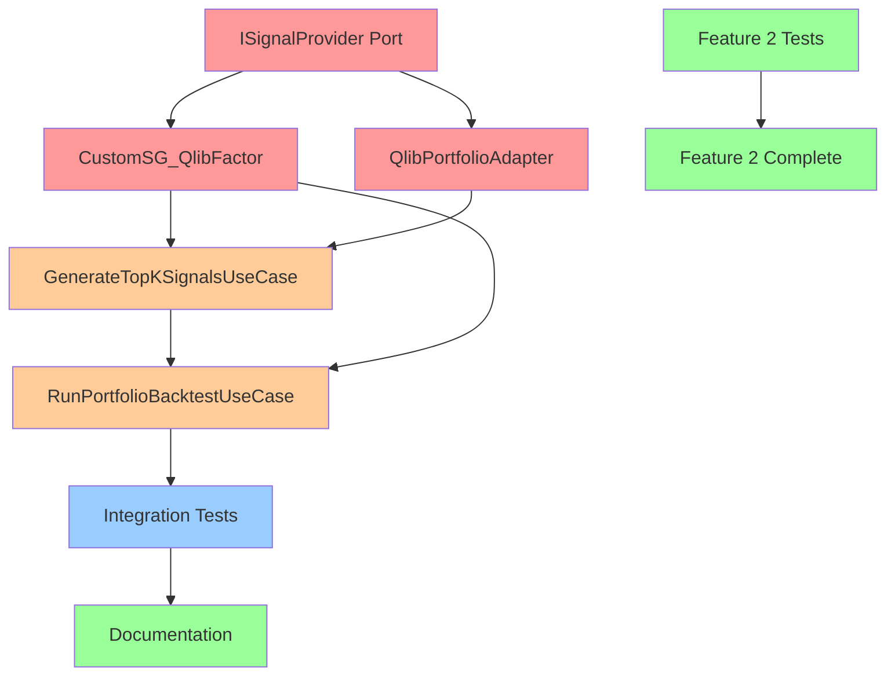

# Implementation Priority Matrix
**Quick Reference Guide for Development Sequencing**

---

## Visual Architecture Gap Analysis

```
┌─────────────────────────────────────────────────────────────────┐
│                    DOMAIN LAYER (Core Business)                  │
│  ✅ Prediction, PredictionBatch                                  │
│  ✅ TradingSignal, SignalBatch                                   │
│  ✅ BacktestResult, Model, Stock                                 │
│  ✅ StockCode, DateRange, BacktestConfig                         │
└─────────────────────────────────────────────────────────────────┘
                              ▲
                              │ Zero Dependencies
                              │
┌─────────────────────────────────────────────────────────────────┐
│                    PORTS LAYER (Interfaces)                      │
│  ✅ ISignalConverter                                             │
│  ✅ IBacktestEngine                                              │
│  ✅ IStockDataProvider                                           │
│  ❌ ISignalProvider (NEEDED FOR FEATURE 1)                       │
└─────────────────────────────────────────────────────────────────┘
                              ▲
                              │ Depends on Ports
                              │
┌─────────────────────────────────────────────────────────────────┐
│                   USE CASES LAYER (Orchestration)                │
│  ✅ ConvertPredictionsToSignalsUseCase                           │
│  ✅ RunBacktestUseCase                                           │
│  ❌ GenerateTopKSignalsUseCase (NEEDED)                          │
│  ❌ RunPortfolioBacktestUseCase (NEEDED)                         │
└─────────────────────────────────────────────────────────────────┘
                              ▲
                              │ Uses Use Cases
                              │
┌─────────────────────────────────────────────────────────────────┐
│                  ADAPTERS LAYER (Framework Integration)          │
│                                                                   │
│  Feature 2 (Signal Conversion):                                  │
│    ✅ SignalConverterAdapter (90% DONE)                          │
│    ✅ QlibToHikyuuSignalConverter (90% DONE)                     │
│                                                                   │
│  Feature 1 (Backtest Integration):                               │
│    ✅ HikyuuBacktestAdapter (80% DONE)                           │
│    ❌ CustomSG_QlibFactor (CRITICAL - NEW)                       │
│    ❌ QlibPortfolioAdapter (CRITICAL - NEW)                      │
│    ❌ DynamicRebalanceSG (OPTIONAL - NEW)                        │
└─────────────────────────────────────────────────────────────────┘
```

---

## Priority Matrix (P0 = Critical, P3 = Nice-to-have)

### Feature 1: Hikyuu Backtest Integration

| Component | Type | Priority | Complexity | Effort | Status |
|-----------|------|----------|------------|--------|--------|
| **ISignalProvider Port** | Port | **P0** | LOW | 0.5d | ❌ Not Started |
| **CustomSG_QlibFactor** | Adapter | **P0** | HIGH | 3d | ❌ Not Started |
| **QlibPortfolioAdapter** | Adapter | **P0** | MEDIUM | 2d | ❌ Not Started |
| **GenerateTopKSignalsUseCase** | Use Case | **P0** | LOW | 1.5d | ❌ Not Started |
| **RunPortfolioBacktestUseCase** | Use Case | **P0** | MEDIUM | 1.5d | ❌ Not Started |
| **DynamicRebalanceSG** | Adapter | P1 | MEDIUM | 2d | ❌ Optional |
| **Integration Tests** | Test | **P0** | MEDIUM | 3d | ❌ Not Started |
| **Documentation** | Docs | P1 | LOW | 1d | ❌ Not Started |

**Total P0 Effort**: 11.5 days

### Feature 2: Signal Conversion

| Component | Type | Priority | Complexity | Effort | Status |
|-----------|------|----------|------------|--------|--------|
| **Integration Test** | Test | P1 | LOW | 0.5d | ⚠️ Needed |
| **CSV/JSON Export Test** | Test | P1 | LOW | 0.5d | ⚠️ Needed |
| **Performance Benchmark** | Test | P2 | LOW | 0.5d | ⚠️ Needed |
| **Multi-model Support** | Enhancement | P3 | MEDIUM | 2d | ❌ Future |

**Total P1 Effort**: 1.5 days

---

## Critical Path Analysis

### Shortest Path to Feature 1 MVP

```
Day 1:     ISignalProvider Port (0.5d)
Day 1-4:   CustomSG_QlibFactor Adapter (3d) ← CRITICAL
Day 3-5:   QlibPortfolioAdapter (2d)
Day 6:     GenerateTopKSignalsUseCase (1.5d)
Day 7-8:   RunPortfolioBacktestUseCase (1.5d)
Day 9-11:  Integration Tests (3d)
Day 12:    FEATURE 1 MVP COMPLETE ✅

CRITICAL PATH: CustomSG_QlibFactor (longest, most complex)
```

### Parallel Development Strategy

**Team of 2 Developers:**

```
Developer A (Backend Lead):
- Day 1-4:  CustomSG_QlibFactor (3d) + Port (0.5d)
- Day 5-7:  RunPortfolioBacktestUseCase (1.5d)
- Day 8-10: Integration Tests (3d)

Developer B (Support):
- Day 1:    Feature 2 completion (1.5d)
- Day 2-4:  QlibPortfolioAdapter (2d)
- Day 4-6:  GenerateTopKSignalsUseCase (1.5d)
- Day 7-10: Documentation (1d) + Testing support

Total Duration: 10 days (vs 12 days sequential)
```

---

## Risk-Effort Matrix

```
High Risk, High Effort        │ High Risk, Low Effort
───────────────────────────────┼───────────────────────────────
❗ CustomSG_QlibFactor        │ ⚠️  Time Alignment Logic
   (3 days, Hikyuu coupling)  │     (part of CustomSG)
                               │
───────────────────────────────┼───────────────────────────────
Low Risk, High Effort          │ Low Risk, Low Effort
                               │
⚠️  Integration Tests (3d)    │ ✅ ISignalProvider Port (0.5d)
                               │ ✅ GenerateTopKSignalsUseCase
                               │ ✅ Feature 2 completion
```

**Mitigation Strategy:**
- Start with **CustomSG_QlibFactor** (highest risk)
- Prototype time alignment logic early
- Write comprehensive unit tests
- Mock Hikyuu for testing

---

## Implementation Checklist

### Week 1: Foundation + Feature 2

- [ ] **Day 1**: Complete Feature 2 testing
  - [ ] Integration test with sample pred.pkl
  - [ ] CSV/JSON export validation
  - [ ] Performance benchmark (baseline)

- [ ] **Day 1-2**: Create ISignalProvider port
  - [ ] Define port interface
  - [ ] Write port documentation
  - [ ] Create port unit tests

- [ ] **Day 2-5**: Implement CustomSG_QlibFactor
  - [ ] Inherit from Hikyuu SignalBase
  - [ ] Implement `_calculate()` method
  - [ ] Implement prediction loading
  - [ ] Implement time alignment
  - [ ] Write unit tests (mock Hikyuu)
  - [ ] Integration test with real Hikyuu

### Week 2: Adapters + Use Cases

- [ ] **Day 6-7**: Implement QlibPortfolioAdapter
  - [ ] Load pred.pkl and calculate Top-K
  - [ ] Implement rebalancing logic
  - [ ] Write unit tests
  - [ ] Integration test

- [ ] **Day 8**: Implement GenerateTopKSignalsUseCase
  - [ ] Top-K filtering logic
  - [ ] Unit tests with mocked ports
  - [ ] Integration test

- [ ] **Day 9-10**: Implement RunPortfolioBacktestUseCase
  - [ ] Portfolio orchestration
  - [ ] Result aggregation
  - [ ] Unit tests
  - [ ] Integration test

### Week 3: Integration + Polish

- [ ] **Day 11-13**: End-to-end integration testing
  - [ ] Single stock backtest
  - [ ] Multi-stock portfolio (10 stocks)
  - [ ] Different rebalancing periods
  - [ ] Performance testing

- [ ] **Day 14**: Documentation
  - [ ] User guide
  - [ ] API documentation
  - [ ] Example notebooks

- [ ] **Day 15**: Code review + deployment prep
  - [ ] Architecture review
  - [ ] Code review
  - [ ] CI/CD pipeline setup

---

## Dependency Graph



**Legend:**
- 🔴 Red: Critical adapters (P0)
- 🟠 Orange: Use cases (P0)
- 🔵 Blue: Testing (P0)
- 🟢 Green: Documentation/Complete (P1-P2)

---

## Quick Decision Guide

### Should I start with Feature 1 or Feature 2?

**Start with Feature 2** if:
- ✅ You want quick wins
- ✅ You want to validate the architecture
- ✅ You have limited Hikyuu experience

**Start with Feature 1** if:
- ⚠️ Backtest integration is blocking other work
- ⚠️ You have Hikyuu expertise available
- ⚠️ You can tolerate higher risk

**Recommended**: Feature 2 first (1-2 days) → Feature 1 (10-12 days)

### What's the minimum viable implementation?

**MVP Scope:**
1. ✅ Feature 2: Signal conversion (already 90% done)
2. ✅ `CustomSG_QlibFactor` with threshold strategy
3. ✅ `QlibPortfolioAdapter` with Top-K selection
4. ✅ Single use case: `RunPortfolioBacktestUseCase`
5. ✅ Basic integration test

**Out of MVP:**
- ❌ DynamicRebalanceSG (can use CustomSG_QlibFactor)
- ❌ Advanced strategies (multi-factor, dynamic threshold)
- ❌ Performance optimization (can add later)
- ❌ Real-time updates (future enhancement)

### When can I deploy to production?

**Criteria:**
- [ ] All P0 components implemented and tested
- [ ] Integration tests passing (90%+ coverage)
- [ ] Performance benchmarks meet targets
- [ ] Documentation complete
- [ ] Code reviewed and approved

**Estimated Timeline**: 15-18 working days from start

---

## Next Actions (Starting Today)

### Immediate (Today)
1. Review this report with team
2. Assign developers to Feature 1 vs Feature 2
3. Setup development branch: `feature/hikyuu-backtest-integration`
4. Create sample `pred.pkl` for testing

### This Week
1. Complete Feature 2 testing (1-2 days)
2. Implement ISignalProvider port (0.5 days)
3. Start CustomSG_QlibFactor prototype (3 days)

### Next Week
1. Complete CustomSG_QlibFactor
2. Implement QlibPortfolioAdapter
3. Implement use cases

### Week 3
1. Integration testing
2. Documentation
3. Code review and deployment

---

**Document Owner**: Backend System Architect
**Last Updated**: 2025-11-14
**Status**: Ready for Implementation
